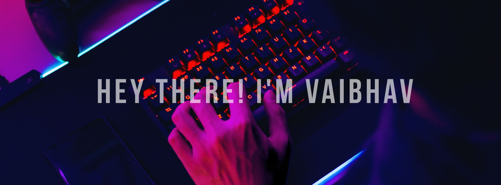

  

### 👨🏻‍💻 About Me
I love exploring new technologies and building real-world software solutions.Computer Science graduate from G.H. Raisoni College of Engineering, Nagpur.Currently learning more about AI Agents, System Design, and Cloud Architecture.I build Full-Stack applications powered by AI/ML — from Vision Transformers to RAG pipelines.Open to collaborations, open-source contributions, or just a great tech chat!
Connect with me on [LinkedIn](https://linkedin.com/in/thevaibhavsengar)
Check out my [Portfolio](https://vaibhavsengar.lovable.app/) — feedback and suggestions are welcome!

## ⚡ Tech Stack

### 👨‍💻 Languages

### 🎨 Frontend

### ⚙️ Backend

### 🗄️ Databases

### 🤖 AI / Data Science

### 🛠️ Tools & Platforms

<!-- your tech stack icons -->

 

---

 

  

## Top Repositories

<table>
  <tr>
    <td width="50%">
      
      

        An end-to-end RAG system that enables intelligent customer support by answering questions from enterprise documents with citation-backed responses. Leverages <b>Google Gemini</b>, <b>LangChain</b>, <b>FAISS</b>, <b>FastAPI</b>, and <b>Streamlit</b> for accurate, context-aware, and scalable document Q&A.
      

    </td>
    <td width="50%">
      
      

        An AI-powered DFU Detection System using a <b>Vision Transformer (ViT)</b> for wound image classification, with a <b>FastAPI</b> backend, <b>React (Vite)</b> frontend, and location-based hospital recommendations via <b>OpenStreetMap</b> & <b>Leaflet</b>.
      

    </td>
  </tr>
  <tr>
    <td width="50%">
      
      

        My GitHub profile README — showcasing my skills, projects, tech stack, and contact links.
      

    </td>
    <td width="50%">
      
      

        A full-stack web app built with <b>React.js</b> and <b>JSON Server</b> for managing interns and internship batches. Features separate portals for <b>Interns</b> and <b>Mentors</b> with role-based access and full CRUD capabilities.
      

    </td>
  </tr>
</table>
